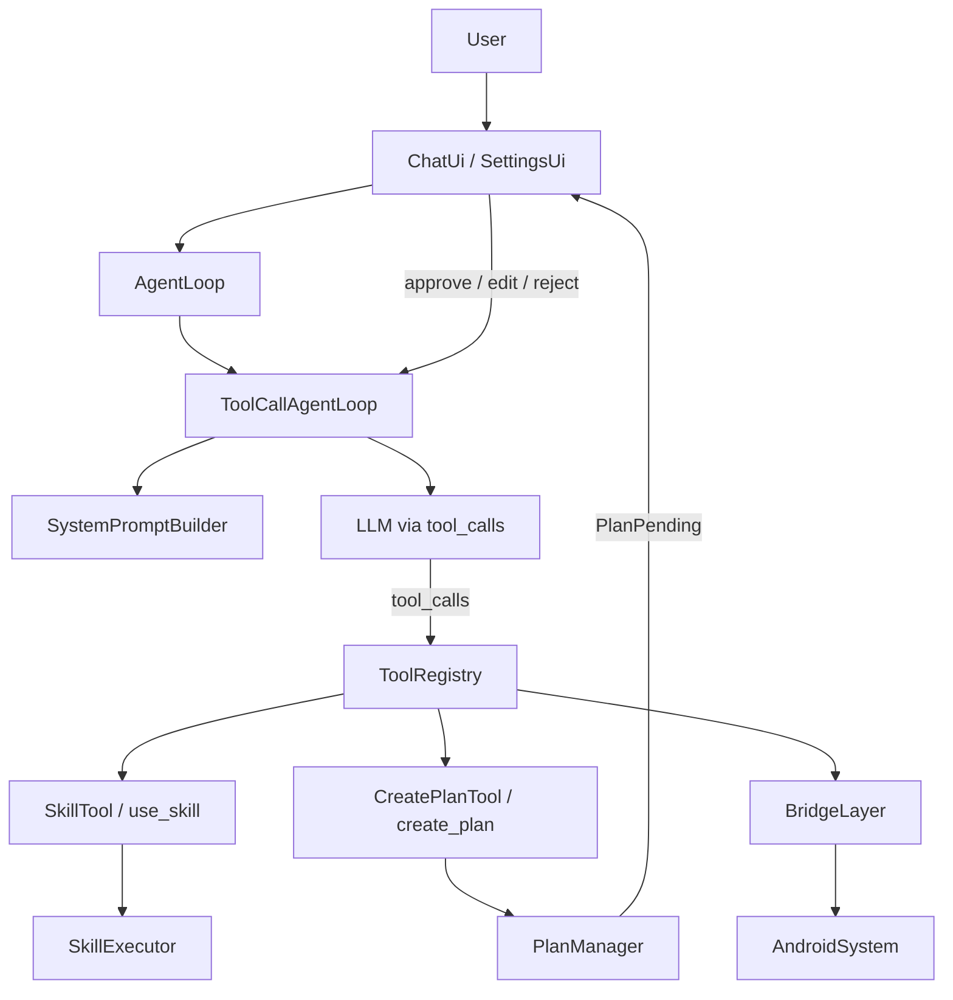

# MobileBot 项目说明

`MobileBot` 是一个 Android 多模块移动端 Agent 项目。当前仓库承接了 Nanobot 向手机端迁移后的继续开发工作，目标是在手机侧提供聊天、工具调用、设备能力桥接和基础自动化能力。

运行链路基于标准 OpenAI `tool_calls` 协议，LLM 直接选择并调用工具，通过 `use_skill` 工具激活技能系统完成复杂任务。

本文档说明项目定位、代码结构、运行链路、本地启动配置和多团队协作边界。

## 一页概览
- 根工程名是 `MobileBot`，是一个 Gradle Kotlin DSL 的 Android 多模块项目。
- 当前主界面优先进入 AIOS 场景体验界面，保留聊天与设置能力。
- `feature:chat` 负责 AIOS 场景 UI、聊天 UI 和设置页，`core:domain` 负责 Agent 规划与工具编排，`core:systemruntime` 负责场景所需的系统运行时能力，`core:bridge` 负责 Android 系统能力桥接，`core:data` 负责数据、配置和后台任务，`core:network` 负责模型/网关调用。
- 当前主聊天会话固定使用 `chatId = "main"`，对应主会话键 `mobile:main`。
- 自动化测试目前只有少量 JVM 单元测试，集中在 `core:domain` 和 `core:data`，没有仓库内的 UI 自动化或仪器测试。
- CI 已配置（GitHub Actions），覆盖编译、单元测试和 Lint。详见 `.github/workflows/ci.yml` 和 `TESTING.md`。

## 当前分支交付范围

本分支补充了 AIOS Agent 场景体验所需的 UI、Agent 闭环和系统运行时能力，目标是让真实 LLM 能按 Skill 指令编排一个可在手机端连续运行的端到端场景。

### AIOS 场景界面
- 新增全屏场景体验界面，默认进入宠物洗护场景。
- 页面分为顶部时间区、可展开任务蓝图区、会话区、单行任务进程区和底部交互区。
- 任务蓝图区默认收起；点击时间区展开，点击蓝图区外收起。展开后默认定位到最新日志，新日志出现时自动滚到底部。
- 会话区按时间顺序混排 AI 消息、用户选择和候选动作；动作被点击后保留原有位置，并用细线蓝光边框表示处理中。
- 任务进程区恢复为单行状态条，用于显示当前执行状态和进度。
- 蓝图区参与方支持动态加入和移除，同时固定显示主 Agent 头像 `NT`，位于第一位。
- 长提醒会以应用内浮层出现，样式用于表达系统提醒，不依赖系统级弹窗。

### 宠物洗护场景 Skill
- 新增 `pet-grooming` Skill，入口位于 `core/data/src/main/assets/skills/md/pet-grooming/SKILL.md`。
- Skill 描述用户偏好、触发条件、参与方、工具链路、用户决策点和时间推进规则。
- 当前场景覆盖周末触发、确认是否预约、查询宠物店联系方式、通过短信确认档期、协调私人司机、创建长提醒、跨天推进、接送与到家确认、支付记账。
- 场景流程不是逐字脚本，而是给 LLM 的事件模板和约束；LLM 需要根据用户选择、短信回复和时间事件继续编排。

### 系统运行时能力
- 新增 `:core:systemruntime` 模块，用于承载场景运行所需的系统能力适配。
- 已注册面向 LLM 的系统工具，包括短信发送、短信等待、联系人查询、提醒创建、服务调用等。
- 工具返回结构保持稳定，便于蓝图区和会话区消费，也便于 LLM 继续基于工具结果推进。
- 支持联系人数据、用户记忆、常用地点和社交关系等资产入口，当前资产位于 `core/systemruntime/src/main/assets/user_memory/`。
- 宠物店信息通过 MCP 获取联系方式和价格；档期仍通过短信确认，更贴近日常沟通链路。

### Agent 闭环修复
- 修复 OpenAI `tool_calls` 多轮历史持久化，避免真实 LLM 在连续工具调用时丢失上下文。
- 修复 plan/action 元数据协议，使 UI 能正确消费计划、动作候选和用户选择。
- 修复子任务 session key 不一致导致的结果读取问题。
- 增加场景决策意图归一化，让用户点击候选动作或自由输入时，都能转成稳定的场景意图再交给 Agent。
- 补充工具调用轮次保护、错误日志和健康检查，避免异常情况下无限循环。

### 验证状态
- 本分支已通过 `./gradlew.bat assembleDebug`。
- 已在 Android 真机上多轮安装测试，覆盖启动、展开蓝图区、动作点击、短信编排、长提醒浮层、跨天时间推进和蓝图区自动滚动。
- 详细测试说明和 CI 入口见 `TESTING.md`。

## 快速开始
1. 用 Android Studio 打开仓库根目录，也就是包含 `settings.gradle.kts` 的这一层。
2. 确认 Gradle JDK 使用 `JDK 17`。
3. 准备 `local.properties`，至少要有 `sdk.dir`；如果要直接联调模型，再补 API Key。
4. 等待 Gradle Sync 完成后运行 `app` 模块到模拟器或真机。
5. 首次进入应用后，先在 `Settings` 页面配置模型服务并保存。
6. 建议先用当前唯一的 `OpenAI-compat` 路径跑通基础聊天，再验证工具能力和权限链路。

## 项目定位

### 当前目标
- 提供一个可在 Android 设备上运行的 Agent 容器。
- 将聊天、规划、工具执行、设备能力访问、配置管理分层拆开，便于多人并行开发。
- 聚焦在 Android 设备上运行本地 Agent 编排能力。

### 当前已具备的能力
- 聊天页与设置页。
- 基于 `tool_calls` 协议的 Agent 循环，LLM 直接驱动工具选择和技能路由。
- Plan Mode：对复杂任务自动生成结构化计划，经用户审批后逐步执行，支持修改和取消。
- SKILL.md 技能系统：27 个内置技能（涵盖通讯、出行、餐饮、健康、购物、理财等），支持 APK 内置、云端下载、用户自建三种来源。
- 技能支持 `inline`（注入当前上下文）和 `fork`（独立子 Agent 执行）两种执行模式。
- 常见手机能力桥接：浏览器、地图、联系人、拨号、短信、相机、剪贴板、分享、位置、通知、日历、深度链接、设备状态、媒体播放、沙盒文件读写、系统设置、闹钟/定时器、手电筒、应用启动。
- 通知监听服务和分享文本导入。
- 基于 WorkManager 的可选心跳任务。

### 当前未完成或仍然简化的部分
- 没有完整的多会话 UI 和会话列表。
- CI 已配置，详见 `.github/workflows/ci.yml` 和 `TESTING.md`。
- 工具审批基础设施存在，但默认实现仍是自动放行。
- 云端技能签名验证和热更新目前是 stub 实现。

## 仓库结构与模块职责

### 顶层目录
| 路径 | 作用 |
| --- | --- |
| `app/` | Android 应用壳，负责 `Application`、`Activity`、服务、权限集成、Hilt 装配。 |
| `feature/` | 面向用户的功能模块，当前只有 `feature:chat`。 |
| `core/` | 核心库模块，拆分模型、总线、网络、桥接、领域和数据层。 |
| `chat_history/` | 迁移、排错和历史沟通记录，不属于运行时代码模块。 |
| `gradle/`、`settings.gradle.kts`、`build.gradle.kts` | Gradle 配置与版本管理。 |

### Gradle 模块
| 模块 | 主要职责 | 典型修改内容 |
| --- | --- | --- |
| `:app` | 应用入口、前台服务、通知监听、Activity、Hilt App 级装配 | Android 清单、启动流程、App 级 DI、服务行为 |
| `:feature:chat` | Compose UI、导航、聊天列表渲染、设置页与 ViewModel | UI 交互、页面状态、设置入口 |
| `:core:model` | 基础模型、消息类型、工具定义、流式事件 | DTO、共享数据结构 |
| `:core:bus` | Agent 到 UI 的消息总线 | Outbound 消息分发 |
| `:core:network` | OpenAI-compatible 客户端与模型请求适配 | Provider 兼容、请求体、SSE 解析 |
| `:core:bridge` | Android 系统能力抽象和实现 | 浏览器、地图、联系人、通知、位置、短信等桥接 |
| `:core:systemruntime` | 场景运行时系统能力适配 | 短信等待、联系人、提醒、服务调用、用户记忆资产 |
| `:core:domain` | Agent 循环（tool_calls）、技能注册与执行、工具注册、权限协调 | 业务规则、技能/工具编排 |
| `:core:data` | Room、设置存储、后台任务、内存文件、技能资产加载 | 持久化、DataStore/Prefs、Worker、实现绑定 |

### 依赖方向
- `app` 依赖 `feature:chat`、`core:data`、`core:domain`、`core:bridge`。
- `feature:chat` 依赖 `core:model`、`core:bus`、`core:domain`、`core:data`、`core:network`、`core:systemruntime`。
- `core:domain` 依赖 `core:model`、`core:bus`、`core:bridge`、`core:network`。
- `core:data` 依赖 `core:model`、`core:bridge`、`core:domain`、`core:network`、`core:systemruntime`。
- `core:model` 和 `core:bridge` 相对底层，适合作为跨团队复用边界。

建议保持这个分层方向，不要把 UI 逻辑压进 `app`，也不要把 Android 具体实现直接塞进 `core:domain`。

## 运行架构

### Agent 运行链路

1. `ChatViewModel.send()` 接收用户输入，通过 `ForegroundController` 拉起前台服务。
2. 调用 `AgentLoop.processUserMessage(chatId, text)`，默认 `chatId = "main"`。
3. `AgentLoop` 委托给 `ToolCallAgentLoop.processUserMessage()`。
4. `LlmConfigurator.beforeRequest()` 同步 API key / base URL / model 到 LLM 客户端。
5. `SessionRepository.appendUserMessage()` 写入 Room，会话键格式 `mobile:{chatId}`。
6. `SystemPromptBuilder` 构建系统提示，包含从 `SkillRegistry` 生成的 `<available_skills>` 目录。
7. `ToolRegistry.definitionsForLlm()` 收集所有工具定义（含 `use_skill`）。
8. 发送消息历史 + 工具定义给 LLM（标准 OpenAI `tool_calls` 协议）。
9. 如果 LLM 返回 `tool_calls`：逐个执行（经过权限检查、`ToolPermissionGate`、`ToolPolicyEngine`），结果追加到上下文，循环回第 8 步。
10. 如果 LLM 调用 `use_skill`：`SkillTool` 路由到 `SkillExecutor`，加载 SKILL.md 后按 `context` 执行（inline 注入指导 / fork 启动子 Agent）。
11. 如果 LLM 调用 `create_plan`：`CreatePlanTool` 将计划存入 `PlanManager`，`ToolCallAgentLoop` 中断循环，向 UI 发送 `TodoListCard` + `ActionPrompt`（执行/修改/取消），等待用户决策。用户批准后恢复消息历史并继续执行，逐步更新步骤状态。
12. 如果 LLM 返回纯文本：输出为助手回复，结束本轮。如果当前在计划执行中，同时将对应步骤标为 COMPLETED。
13. 工具执行结果通过 `MessageBus` 以 `OutboundMessage` 回推到 UI。

### 技能系统

技能采用 SKILL.md 格式定义，YAML frontmatter 声明配置，Markdown body 提供操作指导。

- **模型驱动选择**：LLM 在系统提示中看到 `<available_skills>` 目录，调用 `use_skill` 工具
- **三种来源**：APK 内置（`assets/skills/md/`）、云端下载、用户自建，按优先级覆盖
- **两种执行模式**：`context: inline`（注入当前上下文）/ `context: fork`（独立子 Agent）
- **运行时资格检查**：`SkillEligibilityChecker` 根据 `requires` 和 `conditions` 动态过滤
- **编排**：`composes-skills` 允许技能递归组合子技能

启动时 `SkillAssetLoader.loadAllSkills()` 从 `assets/skills/md/` 加载 SKILL.md 技能，从 `assets/skills/bundled/` 加载遗留 JSON 格式技能，统一注册到 `SkillRegistry`。

### 计划模式 (Plan Mode)

对于复杂多步任务，LLM 会自动调用 `create_plan` 工具生成结构化计划，而不是直接执行。流程：

1. LLM 判断任务复杂度（3+ 步骤 / 高风险 / 多技能编排），调用 `create_plan(title, steps)`。
2. `CreatePlanTool` 将计划存入 `PlanManager`，`ToolCallAgentLoop` 中断循环。
3. UI 显示 `TodoListCard`（计划步骤）+ `ActionPrompt`（执行 / 修改 / 取消）。
4. 用户批准后，恢复 LLM 消息历史并注入 "Plan approved" 上下文，逐步执行。
5. 每步完成后更新 `TodoStatus`（PENDING → RUNNING → COMPLETED），UI 实时刷新。
6. 用户可在审批前修改计划（LLM 重新生成）或取消。

复用已有的 `TodoListCodec` 和 `ActionPromptCodec` UI 组件，无需新增 Compose 组件。

### 工具系统

- `DomainToolModule` 通过 Hilt 多绑定注入所有工具到 `ToolRegistry`。
- 每个工具声明 `name`、`ToolDefinition`、`requiredCapabilities`、`executionPolicy`。
- `ToolRegistry.execute()` 经过 `ToolPolicyEngine` 做能力、前台态和联网约束检查。
- 工具通过 `DeviceCapabilityBridge` 和 `SystemBridge` 调用 Android 系统能力。

## 当前内置能力清单

### 技能（27 个 SKILL.md）

| 分类 | 技能 |
| --- | --- |
| 基础能力 | `browser` `maps` `messaging` `contacts` `camera` `share` `location` `workspace-files` `notifications` `smart-contact-action` `system-settings` `alarm-timer` `app-launcher` `utility` |
| 餐饮 | `dining` `food-delivery` |
| 出行 | `ride-hailing` `navigation` |
| 住宿 | `hotel-booking` |
| 健康 | `hospital-appointment` `medication-reminder` |
| 购物 | `product-search` |
| 日程/理财 | `schedule-management` `expense-tracking` `express-delivery` |
| 场景编排 | `road-accident-response` `travel-abroad` |

### 工具

| 工具名 | 作用 |
| --- | --- |
| `use_skill` | 调用技能系统（LLM 路由入口） |
| `create_plan` | 为复杂任务生成结构化计划，展示给用户审批后执行 |
| `open_url` | 在浏览器中打开网页 |
| `open_map` | 打开地图/导航 |
| `search_contacts` | 查找联系人 |
| `dial_number` | 打开拨号盘预填号码 |
| `send_sms` | 发送短信或打开草稿 |
| `get_current_location` | 读取当前位置 |
| `open_camera` | 打开相机 |
| `copy_to_clipboard` | 写入剪贴板 |
| `share_text` | 打开系统分享 |
| `read_sandbox_file` / `write_sandbox_file` | 读写沙盒文件 |
| `list_notifications` / `create_notification` | 通知读取/创建 |
| `create_calendar_event` / `query_calendar` | 日历事件 |
| `deep_link_app` | 通过深度链接打开应用 |
| `get_device_state` | 获取设备状态 |
| `play_media` | 播放媒体 |
| `call_service` | 调用外部服务 |
| `open_settings` / `set_alarm` / `set_timer` / `toggle_flashlight` / `open_app` | 系统操作 |
| `spawn_subtask` / `check_subtask` / `publish_fact` | 子任务编排 |
| `read_user_profile` | 读取用户偏好 |

### Android 系统接入点
- `MainActivity` 支持接收 `ACTION_SEND` 文本分享。
- `MobileBotNotificationListenerService` 会把系统通知镜像到 `NotificationHistoryStore`。
- `AgentForegroundService` 用于本地 Agent 运行期间的前台服务保活。
- `HeartbeatScheduler` 使用 WorkManager 做可选的周期心跳任务。

## 状态、会话和数据存储

### 聊天消息
- 会话消息通过 Room 持久化，由 `SessionRepositoryImpl` 实现。
- 主聊天页面固定使用 `chatId = "main"`，消息落在会话 `mobile:main`。
- UI 启动时会从数据库中恢复消息，再监听 `MessageBus` 的新输出。

### 工作记忆与长期记忆
- `MemoryFacade` 负责工作记忆、摘要和事实检索。
- `MemoryFileRepository` 会读写 memory 相关文件。
- `ToolCallAgentLoop` 在每轮执行前构建 memory digest，注入系统提示。

## 术语表
| 术语 | 含义 |
| --- | --- |
| `SessionKey` | 会话唯一键，格式 `mobile:{chatId}`。 |
| `Skill` | SKILL.md 定义的技能，通过 `use_skill` 工具被 LLM 调用。 |
| `SkillEntry` | 技能在 `SkillRegistry` 中的注册条目，包含 manifest 和 contentPath。 |
| `Tool` | 可执行的原子能力，例如 `open_url`、`send_sms`。 |
| `tool_calls` | OpenAI 标准协议，LLM 直接选择并调用工具。 |
| `ToolCallAgentLoop` | 主 Agent 循环，实现 tool_calls 迭代执行。 |
| `SkillTool` | 名为 `use_skill` 的特殊工具，LLM 通过它激活技能。 |
| `SkillExecutor` | 执行技能的核心逻辑，支持 inline 和 fork 两种模式。 |
| `CreatePlanTool` | 名为 `create_plan` 的工具，LLM 用它生成结构化计划。 |
| `PlanManager` | 管理每个聊天的计划状态机（NONE/PENDING/EXECUTING/DONE）。 |
| `WorkingMemory` | 每轮执行中的暂存状态、观察结果和错误信息。 |
| `MessageBus` | Agent 到 UI 的运行时消息通道。 |

## 新增功能指南

### 新增技能
1. 在 `core/data/src/main/assets/skills/md/{skill-name}/SKILL.md` 创建 SKILL.md。
2. frontmatter 声明 `name`、`description`、`category`、`allowed-tools`、`context`、`effort`、`risk`、`requires` 等。
3. Markdown body 提供操作步骤指导。
4. 应用启动时 `SkillAssetLoader` 会自动加载并注册。

### 新增工具
1. 在 `core:domain/tools` 中新增 `Tool` 实现。
2. 如需 Android 系统 API，在 `core:bridge` 增加接口。
3. 在 `DomainToolModule` 中绑定。
4. 增加单元测试。
